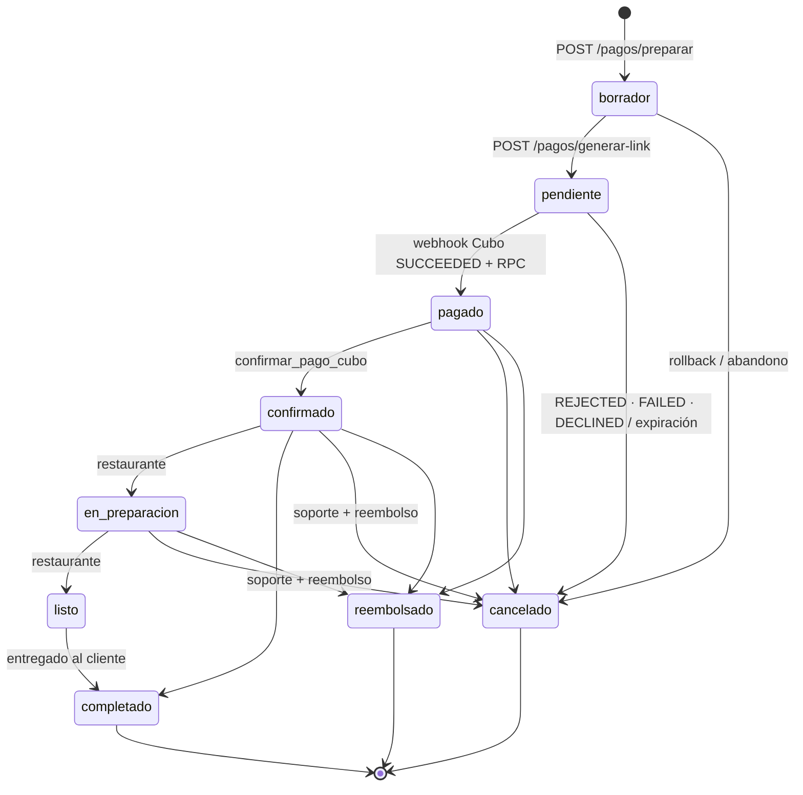

# Bocara — Máquina de estados de pedidos y contratos de API

> **Para:** Ingeniero 2 (Melanie) — integración móvil y panel.
> **Fuente canónica en código:** [`backend/services/orderStateMachine.js`](../backend/services/orderStateMachine.js).
> Si este documento y el código difieren, gana el código: avísame y corrijo el documento.

Este documento cierra la segunda mitad de la auditoría técnica. Cubre cuatro
cosas: qué transiciones de estado existen, cuándo se reserva y se libera el
stock, qué forma exacta tienen las respuestas de error, y cómo se interpretan
las ventanas horarias que cruzan la medianoche.

---

## 0. Antes de nada: dos columnas, no una

Un pedido tiene **dos** columnas de estado y confundirlas es la causa de la
mitad de los bugs de este flujo:

| Columna | Gobierna | Valores |
|---|---|---|
| `pedidos.estado` | El ciclo de vida del pedido. Lo gobierna la máquina de estados. | `borrador`, `pendiente`, `confirmado`, `en_preparacion`, `listo`, `completado`, `recogido`, `cancelado` |
| `pedidos.estado_pago` | Lo que dijo la pasarela. Es un dato de Cubo, **no** un estado del pedido. | `pendiente`, `pagado`, `fallido` |

**`estado_pago = 'pagado'` NO es prueba de que se cobró.** El webhook legacy de
PayU y la ruta retirada `POST /pedidos/crear` también escribían ese valor sin
verificar nada. La única prueba confiable es que `cubo_payment_intent_token` y
`cubo_identifier` estén **ambos** presentes: solo se escriben juntos dentro de
la RPC `confirmar_pago_cubo`, y solo después de que el webhook consultó a Cubo
por su cuenta y obtuvo `SUCCEEDED`.

> Para listar pedidos "reales" en la app, filtra por esas dos columnas no nulas,
> como hace `filtrarSoloPagosCuboVerificados` en `backend/routes/pedidos.js`.

### Los dos vocabularios

El **modelo canónico** del negocio tiene seis estados:
`pendiente → pagado → confirmado → completado`, más `cancelado` y `reembolsado`.

La columna real usa además estados **operativos** que el canónico no nombra:

| Estado | Qué es |
|---|---|
| `borrador` | Carrito creado por `POST /pagos/preparar`. Aún no hay intención de pago. **Nunca mostrar al cliente ni al restaurante.** |
| `en_preparacion` | El restaurante aceptó y está armando la bolsa. |
| `listo` | Bolsa lista para recoger. |
| `recogido` | Nombre anterior de `completado`. Solo en filas viejas; no se crean nuevos. |

Y hay un desfase que conviene tener presente: **`pagado` y `reembolsado` no son
hoy valores de `pedidos.estado`**. `pagado` vive en `estado_pago`, y el reembolso
se registra en `motivo_cancelacion` sobre un pedido `cancelado`. El módulo
expone las dos matrices (`TRANSICIONES` canónica y `TRANSICIONES_OPERATIVAS`,
la que se aplica contra la BD) y comparten regla crítica y condiciones.

---

## 1. Transiciones

### Diagrama



> `pendiente → pagado → confirmado` lo ejecuta la RPC `confirmar_pago_cubo` en
> **una sola transacción**. Desde fuera parece un salto directo, pero son dos
> aristas encadenadas y se validan las dos (`validarConfirmacionPago`).

### Tabla de transiciones permitidas

| Desde | Hacia | Quién la dispara |
|---|---|---|
| `borrador` | `pendiente` | `POST /api/pagos/generar-link` |
| `borrador` | `cancelado` | Rollback de `/pagos/preparar`, barrido de carritos abandonados |
| `pendiente` | `pagado` | Webhook de Cubo, tras verificar `SUCCEEDED` de forma independiente |
| `pendiente` | `cancelado` | Webhook de rechazo (`REJECTED` / `FAILED` / `DECLINED`, ver §1.4), nuevo checkout del mismo usuario |
| `pagado` | `confirmado` | RPC `confirmar_pago_cubo` |
| `pagado` | `cancelado` / `reembolsado` | Soporte (admin) |
| `confirmado` | `en_preparacion` | Restaurante — `PUT /api/pedidos/:id/estado` |
| `confirmado` | `completado` | Restaurante |
| `confirmado` | `cancelado` / `reembolsado` | Soporte (admin), con reembolso registrado |
| `en_preparacion` | `listo` | Restaurante |
| `en_preparacion` | `cancelado` / `reembolsado` | Soporte (admin) |
| `listo` | `completado` | Restaurante (cliente recogió) |

### Tabla de transiciones PROHIBIDAS

| Desde | Hacia | Por qué |
|---|---|---|
| **`pendiente`** | **`confirmado`** | **REGLA CRÍTICA.** Confirmar sin pasar por `pagado` entregaría la bolsa sin haber cobrado. Ver §1.1. |
| `borrador` | `confirmado` | Un carrito sin siquiera link de pago emitido. |
| `borrador` | `pagado` | No tiene `cubo_payment_intent_token` con el que verificar nada. |
| `completado` | cualquiera | Terminal. |
| `recogido` | cualquiera | Terminal (legacy). |
| `cancelado` | cualquiera | Terminal. Un pedido cancelado **no se revive**: se crea uno nuevo. |
| `reembolsado` | cualquiera | Terminal. |
| `confirmado` | `pendiente` | No se retrocede en el ciclo de vida. |
| `en_preparacion` | `completado` | Debe pasar por `listo`. |
| `pendiente` | `completado` | Salta todo el flujo de pago y preparación. |
| `listo` | `cancelado` | El producto ya está listo para recoger. Cualquier cancelación, reembolso y conciliación es un caso excepcional/manual fuera del flujo automático hasta que exista un contrato específico. |
| `listo` | `recogido` | `recogido` es legacy; los pedidos nuevos van a `completado`. |

### 1.1 La regla crítica

> **Un pedido `pendiente` NUNCA pasa directo a `confirmado`.**

`pendiente` significa "hay un link de pago emitido" y nada más. Nadie ha
comprobado que el dinero se movió. Para llegar a `confirmado`, el pedido tiene
que haber pasado por `pagado`, y a `pagado` solo se llega con verificación
independiente de Cubo.

La prohibición se comprueba **antes** que la matriz, en una lista explícita
(`TRANSICIONES_PROHIBIDAS`). Es deliberadamente redundante: aunque alguien
añadiera la arista a la matriz por error, la transición seguiría rechazándose.
`test/pedidosStateMachine.test.js` falla si la arista aparece en cualquiera de
las dos matrices.

El único camino autorizado es `validarConfirmacionPago()`, que valida las dos
aristas por separado y solo lo usa el webhook de Cubo.

### 1.2 Condiciones (transiciones condicionadas)

Estar en la matriz no basta. Tres destinos exigen además una condición del
mundo real:

| Hacia | Condición | Código de error si falla |
|---|---|---|
| `pagado` | `cubo_payment_intent_token` **y** `cubo_identifier` presentes, o el llamante es el webhook que ya verificó con Cubo (`pagoVerificado: true`) | `PAGO_NO_VERIFICADO` |
| `confirmado` | Misma prueba de pago | `PAGO_NO_VERIFICADO` |
| `reembolsado` | `monto_reembolsado`, `referencia_reembolso` y `fecha_reembolso` registrados | `REEMBOLSO_NO_REGISTRADO` |

Cubo Pago **no tiene API de reembolso**: el admin devuelve el dinero por fuera y
registra la evidencia. Sin esos tres datos el pedido quedaría cerrado sin rastro
de a dónde fue el dinero, así que la transición se rechaza.

### 1.3 Cómo usar el módulo

```js
const { validarTransicion, puedeTransicionar } = require('../services/orderStateMachine');

// Para decidir si pinto un botón (sin explicación):
puedeTransicionar('confirmado', 'en_preparacion'); // → true

// Antes de mutar la BD (con explicación, y con forma de respuesta HTTP):
const v = validarTransicion(pedido.estado, nuevoEstado, { pedido });
if (!v.ok) {
  return res.status(v.status).json({
    ok: false, error: v.error, codigo: v.codigo, detalle: v.detalle,
    estado_actual: v.estadoActual, transiciones_permitidas: v.transicionesPermitidas,
  });
}
```

**No declares matrices de transiciones en tu código.** Antes había una copia
local en `routes/pedidos.js` que divergió y acabó permitiendo
`pendiente → confirmado`. Si necesitas la lista de destinos válidos desde un
estado, usa `transicionesDesde(estado)`.

### 1.4 Estados de la pasarela: normalización

El `status` que llega en el webhook de Cubo no es un estado del pedido; se
traduce a uno de tres estados internos en `normalizarEstadoCubo`
(`backend/services/cuboWebhook.js`) **antes** de decidir cualquier transición:

| `status` recibido | Estado interno | Efecto |
|---|---|---|
| `SUCCEEDED` | `aprobado` | Consulta independiente a Cubo + RPC `confirmar_pago_cubo` |
| `REJECTED`, `FAILED`, `DECLINED` | `fallido` | Un único flujo de rechazo: log estructurado, `liberarInventarioPedido` y `estado_pago = 'fallido'` |
| cualquier otro (`PENDING`, `CANCELLED`, `REFUNDED`, …) | `desconocido` | 200 sin tocar nada; queda en log como `estado_desconocido` |

Cubo documenta `REJECTED`, pero los contratos y otras pasarelas del mismo
proveedor emiten `FAILED` o `DECLINED` para el mismo hecho (no hubo cargo).
Los tres son **equivalentes**: entran por la misma rama, producen la misma
respuesta y disparan la misma liberación de stock. La comparación es
insensible a mayúsculas y espacios (`"  failed "` → `FAILED`), y el literal
recibido se conserva en los logs (`status`) y en el `motivo_cancelacion`
(`status:<RAW>`) para auditoría.

Un rechazo **nunca** cancela un pedido con `estado_pago = 'pagado'`: un
`REJECTED`/`FAILED`/`DECLINED` que llega tarde o duplicado se ignora con
200 y queda registrado como `rechazo_sobre_pedido_pagado_ignorado`.

---

## 2. Ciclo de vida de stock y reserva

Este es el punto donde más fácil se duplica inventario, así que vale la pena
leerlo entero.

### Hay DOS mecanismos distintos, no uno

| | Reserva implícita | Descuento real |
|---|---|---|
| **Qué es** | Un pedido `borrador`/`pendiente` se *cuenta* como reservado al calcular disponibilidad | `bolsas.cantidad_disponible` se decrementa en la BD |
| **Dónde vive** | En el cálculo de `services/stock.js` (`getReservadoPendiente`, `getReservasMap`) | En la columna `bolsas.cantidad_disponible` |
| **Cuándo ocurre** | Automáticamente, por el solo hecho de que el pedido exista en ese estado | Una única vez, dentro de la RPC `confirmar_pago_cubo` |
| **Cómo se libera** | Sacando el pedido de ese estado (p. ej. a `cancelado`) | Sumando las unidades de vuelta |

La disponibilidad que ve el cliente es siempre:

```
disponible_real = bolsas.cantidad_disponible − reservado_por_pedidos_pendientes
```

### Línea de tiempo

| Momento | `estado` | `cantidad_disponible` | Reserva implícita |
|---|---|---|---|
| `POST /pagos/preparar` crea el carrito | `borrador` | sin cambios | — |
| `POST /pagos/generar-link` | `pendiente` | sin cambios | **activa** |
| Webhook Cubo `SUCCEEDED` → `confirmar_pago_cubo` | `confirmado` | **−N** (atómico, con `FOR UPDATE`) | liberada |
| Restaurante prepara y entrega | `en_preparacion` → `listo` → `completado` | sin cambios | — |
| Cancelación de un pedido **no cobrado** | `cancelado` | **sin cambios** | liberada |
| Cancelación de un pedido **ya cobrado** | `cancelado` | **+N** | — |

### La regla que evita duplicar stock

> Cancelar un pedido `borrador` o `pendiente` **no suma unidades**. Su reserva
> era implícita y el cambio de estado ya la liberó. Sumar ahí duplicaría el
> stock.

En código: `orderStateMachine.requiereDevolucionDeStock(estado)` → `false` para
`borrador` y `pendiente`, `true` a partir de `pagado`.

### Idempotencia: `liberarInventarioPedido`

Todas las cancelaciones que puedan tener stock descontado pasan por
**`services/stock.js → liberarInventarioPedido(pedidoId, opciones)`**. Es el
único punto que devuelve inventario.

El "exactamente una vez" se garantiza con un **compare-and-swap sobre `estado`**:

```js
.update({ estado: 'cancelado', ... })
.eq('id', pedidoId)
.in('estado', cancelables)   // ← solo aplica si sigue en un estado cancelable
.select('id').maybeSingle()  // ← null si no coincidió ninguna fila
```

Solo la primera llamada encuentra el pedido en un estado cancelable y recibe una
fila; las siguientes reciben `null`. La devolución de stock cuelga de ese
resultado, así que corre solo para el ganador. **El propio `estado` es la marca
de idempotencia** — no hace falta columna ni tabla extra.

Esto importa porque **Cubo reintenta sus webhooks**. Sin esta garantía, cada
reintento de un rechazo (`REJECTED` / `FAILED` / `DECLINED`) devolvía unidades
otra vez y el negocio terminaba con más stock del que realmente tenía.

Resultados posibles:

| `tipo` | `ok` | HTTP | Significado |
|---|---|---|---|
| `cancelado` | `true` | 200 | Esta llamada ganó el CAS y canceló. `stockDevuelto` dice si además sumó unidades. |
| `ya_cancelado` | `true` | 200 | No-op idempotente. **No es un error**: ya estaba cancelado, o otra llamada ganó la carrera. |
| `transicion_invalida` | `false` | 400 / 409 | El estado actual no admite cancelación (terminal, o fuera de `estadosPermitidos`). |
| `no_encontrado` | `false` | 404 | — |
| `error_bd` | `false` | 503 | Fallo de BD; no se corrompió nada. Reintentar es seguro. |

**Limitación conocida:** la devolución de unidades se hace fila por fila desde
Node, no en una transacción. Si el proceso muere a mitad, parte del stock queda
sin devolver (**nunca duplicado**) y el faltante se corrige a mano. La mejora
pendiente es mover esa parte a una RPC `liberar_stock_pedido`, igual que
`confirmar_pago_cubo`.

### Cupones

Van por su propio carril, siempre vía RPC y siempre idempotentes:
`reservar_cupon` al crear el pedido, `consumir_cupon_pedido` al confirmarse el
pago, `liberar_reserva_cupon` al cancelar o rechazar. Se llaman *best-effort*
(su fallo no tumba la cancelación) y se registran en log.

---

## 3. Contrato de respuestas de error

### Forma canónica

Todo error nuevo responde con esta forma:

```json
{
  "ok": false,
  "error": "TRANSICION_INVALIDA",
  "detalle": "No se puede cambiar de \"listo\" a \"cancelado\". Transiciones válidas desde \"listo\": completado.",
  "codigo": "TRANSICION_INVALIDA",
  "estado_actual": "listo",
  "transiciones_permitidas": ["completado"]
}
```

- **`error`** — categoría estable. Es lo que debes usar para ramificar.
- **`codigo`** — matiza el motivo dentro de la categoría (ver tabla abajo).
- **`detalle`** — texto en español, ya redactado para mostrarse al usuario.
- **`transiciones_permitidas`** — útil para refrescar la UI sin otra llamada.

> **Nota de compatibilidad:** rutas antiguas todavía responden `{ error: "texto
> legible" }` sin `ok`. Al leer un error, trata `ok === false` **y** la presencia
> de `error` como señales de fallo, y usa `detalle ?? error` para el mensaje.
> Estamos migrando a la forma nueva por endpoint, no de golpe.

### Códigos por estado HTTP

| HTTP | `error` | `codigo` | Cuándo | ¿Reintentar? |
|---|---|---|---|---|
| **400** | `TRANSICION_INVALIDA` | `TRANSICION_INVALIDA` | La transición no está en la matriz, o está prohibida | No — corrige el flujo |
| **400** | `TRANSICION_INVALIDA` | `ESTADO_TERMINAL` | El pedido ya está cerrado (`completado`, `cancelado`, `recogido`, `reembolsado`) | No |
| **400** | `TRANSICION_INVALIDA` | `ESTADO_DESCONOCIDO` | Estado que la máquina no conoce (dato corrupto o migración a medias) | No — reportar |
| **400** | `TRANSICION_INVALIDA` | `PAGO_NO_VERIFICADO` | Se intentó confirmar sin prueba de pago de Cubo | No |
| **400** | `REEMBOLSO_NO_REGISTRADO` | — | Falta `monto_reembolsado`, `referencia_reembolso` o `fecha_reembolso` | No — completa los datos |
| **400** | `ESTADO_INVALIDO` | — | El `estado` pedido no es un destino válido desde el panel | No |
| **403** | `NO_AUTORIZADO` | — | No eres el dueño del pedido ni del negocio, ni admin | No |
| **404** | `PEDIDO_NO_ENCONTRADO` | — | El id no existe | No |
| **409** | `CONFLICTO_DE_ESTADO` | — | El pedido cambió entre el SELECT y el UPDATE (carrera) | **Sí** — recarga y reintenta |
| **409** | `TRANSICION_INVALIDA` | `ESTADO_NO_CANCELABLE` | Estado válido en general, pero no cancelable desde *este* flujo (p. ej. soporte no cancela un `listo`) | No |
| **500** | `ERROR_INTERNO` | — | Excepción no prevista | Sí, una vez |
| **503** | `BD_NO_DISPONIBLE` | — | La BD no respondió. **No se mutó nada** | **Sí, con backoff** |

### Errores propios del webhook de Cubo (`POST /api/webhooks/cubo`)

Aquí el status **le habla a Cubo**, no a la app. Cubo reintenta ante `5xx`.

| HTTP | Cuándo | Efecto |
|---|---|---|
| **200** | Procesado, duplicado, estado no reconocido, o pedido no encontrado | Cubo deja de reintentar |
| **400** | Payload incompleto (falta `identifier` o `metadata.orderId`) | Cubo deja de reintentar |
| **409** | Discrepancia entre lo que dice Cubo y lo almacenado: token, moneda, monto, stock insuficiente, o **la máquina rechaza la transición con el pago ya cobrado** | **Requiere intervención manual** — queda en log como `CRÍTICO` |
| **422** | El pedido no tiene `cubo_payment_intent_token` o `monto_esperado_centavos` válidos | Fail-closed |
| **502** | No se pudo consultar a Cubo (red / Cubo caído) | Cubo reintenta |
| **503** | Falta configuración (`CUBO_CURRENCY`), migración SQL pendiente, o no se pudo cancelar un rechazado | Cubo reintenta |

**Principio del webhook: fail-closed.** Cualquier dato de verificación ausente
o inválido detiene el procesamiento. Nunca se toca stock, puntos, QR ni
notificaciones si la validación falla.

### Endpoints tocados en esta auditoría

#### `PUT /api/pedidos/:id/estado` — restaurante avanza el pedido

Destinos aceptados: `en_preparacion`, `listo`, `completado`, `recogido`, `cancelado`.

- Valida con `validarTransicion` antes de tocar la BD.
- El `UPDATE` usa `.eq('estado', estadoLeido)` — si el pedido se movió mientras
  tanto, responde **409 `CONFLICTO_DE_ESTADO`** en vez de pisar el estado nuevo.
- `estado: 'cancelado'` se desvía a `liberarInventarioPedido` únicamente desde
  los estados cancelables; un pedido `listo` se rechaza antes de tocar pedido o
  inventario. Ese servicio es el único camino que devuelve inventario. Responde
  `{ ok: true, tipo, estado: 'cancelado', stock_devuelto }`.

#### `PATCH /api/pedidos/:id/cancelar` — soporte, con reembolso registrado

- **No admin → 403** con los datos de WhatsApp de soporte.
- Exige `monto_reembolsado`, `referencia_reembolso`, `fecha_reembolso` → si
  faltan, **400 `REEMBOLSO_NO_REGISTRADO`**.
- Solo cancela desde `confirmado` o `en_preparacion`. `listo`, `completado` y
  `recogido` → **409 `ESTADO_NO_CANCELABLE`** (el cliente ya tiene la bolsa o
  está lista para recoger).
- Ya cancelado → **200 `{ ok: true, tipo: 'ya_cancelado' }`**. Idempotente.
- Éxito → `{ ok: true, tipo: 'cancelado_por_admin', stock_devuelto, mensaje }`.

#### `POST /api/pagos/generar-link` — nuevo 409

Ahora puede responder **409 `CONFLICTO_DE_ESTADO`**. El pedido se lee como
`borrador`, pero generar el link es una llamada de red a Cubo y el barrido de
borradores expirados (cada 2 h) puede cancelarlo en esa ventana. Antes el
`UPDATE` resucitaba el pedido cancelado a `pendiente`; ahora el update lleva
`.eq('estado', 'borrador')` y, si no coincide, **no se devuelve la URL de pago**
— cobrar contra un pedido cancelado es peor que pedir al cliente que reinicie el
checkout.

**En la app:** ante este 409, vuelve a `POST /pagos/preparar` en vez de mostrar
un error genérico.

### Dos cambios de comportamiento a tener en cuenta

1. **`confirmado → completado` ahora está permitido.** Antes la matriz de
   `routes/pedidos.js` obligaba a pasar por `en_preparacion` y `listo`. El
   modelo canónico lo admite como salto directo, así que el panel puede ofrecer
   "marcar como entregado" desde `confirmado`. Si prefieres que el restaurante
   siga obligado a recorrer los tres pasos, dímelo y lo quito de la matriz: es
   una línea.

2. **`PUT /api/pedidos/:id/estado` puede responder 409.** El `UPDATE` ahora
   compara contra el estado leído, así que dos pestañas del panel avanzando el
   mismo pedido ya no se pisan. La segunda recibe `CONFLICTO_DE_ESTADO` y debe
   recargar.

---

## 4. Ventanas horarias y cruce de medianoche

Todo cálculo de fechas y horas de publicaciones pasa por
[`backend/services/horarioGuatemala.js`](../backend/services/horarioGuatemala.js).
**No calcules horarios por tu cuenta.**

### Por qué existe este módulo

El servidor corre en UTC (Render). Guatemala es UTC−6 todo el año (sin horario
de verano), así que `new Date().toISOString()` adelanta el día a partir de las
**18:00 hora de Guatemala** — una publicación válida hasta hoy desaparecía del
feed seis horas antes de tiempo.

El cálculo se hace con `Intl` y la zona IANA `America/Guatemala`, no restando 6
horas a mano: así sigue siendo correcto si esa regla cambiara y no depende de la
zona horaria del proceso.

### El cruce de medianoche

Una bolsa tiene `hora_recogida_inicio`, `hora_recogida_fin` y `fecha_caducidad`.

> **Si `hora_fin < hora_inicio`, la ventana cruza la medianoche** y termina el
> día **siguiente** a `fecha_caducidad`.

| `fecha_caducidad` | `inicio` | `fin` | Termina realmente en |
|---|---|---|---|
| 2026-09-11 | `18:00` | `20:00` | 2026-09-11 **20:00** |
| 2026-09-11 | `22:00` | `02:00` | 2026-09-**12** **02:00** ← cruza |
| 2026-09-11 | `00:00` | `23:59` | 2026-09-11 23:59 |

La comparación es **lexicográfica** sobre cadenas de ancho fijo
(`'YYYY-MM-DD'`, `'HH:MM:SS'`), no sobre objetos `Date`. Por eso
`normalizarHora` rellena siempre a `HH:MM:SS` — `'9:00'` no es comparable,
`'09:00:00'` sí.

### API

| Función | Devuelve |
|---|---|
| `ahoraGuatemala(ref?)` | `{ fecha: 'YYYY-MM-DD', hora: 'HH:MM:SS' }` en hora local de Guatemala |
| `hoyGuatemala(ref?)` | `'YYYY-MM-DD'` de hoy en Guatemala |
| `normalizarHora(h)` | `'HH:MM'` \| `'HH:MM:SS'` → `'HH:MM:SS'`; cualquier otra cosa → `null` |
| `normalizarFecha(f)` | `'YYYY-MM-DD'` o `null` |
| `finVentanaRecogida(bolsa, ahora?)` | `{ fecha, hora }` del cierre real, **ya con el cruce de medianoche aplicado**; `null` si no hay hora de fin usable |
| `estaVencida(bolsa, ahora?)` | `true` si la ventana ya cerró |
| `filtrarVigentes(bolsas, ahora?)` | Solo las vigentes, con **una sola lectura de la hora** para todo el lote |
| `validarHorarioFuturo(bolsa, ahora?)` | `MENSAJE_HORARIO_VENCIDO` o `null` — para escrituras (crear / editar / reactivar) |

### Dos detalles que sí importan

1. **Al llegar exactamente a `hora_recogida_fin`, la publicación ya está
   vencida.** La comparación es `fin.hora <= ahora.hora`: nadie puede recoger en
   el instante del cierre.

2. **Lectura y escritura no se validan igual.** En escritura, una
   `fecha_caducidad` ya pasada **nunca** se acepta, aunque la ventana cruce la
   medianoche y técnicamente siguiera abierta. En lectura sí se respeta el
   cruce. Por eso hay dos funciones (`estaVencida` para leer,
   `validarHorarioFuturo` para escribir) y no una.

3. **Pasa `ahora` explícitamente al filtrar listas.** `filtrarVigentes` lee la
   hora una sola vez para todo el lote, de modo que un elemento no se evalúe
   contra un segundo distinto que el siguiente. Si llamas `estaVencida` en un
   bucle sin pasar `ahora`, pierdes esa garantía.

### Consumo desde el cliente

Las horas viajan como texto plano (`'18:00:00'`), **sin zona horaria**, y son
siempre hora de Guatemala. No las conviertas con `new Date(...)` en el cliente:
el teléfono aplicaría su propia zona y correría la ventana. Muéstralas tal cual,
y si necesitas saber si algo venció, pregúntaselo al backend.

---

## 5. Pruebas

```bash
cd backend
npm run check                  # node --check sobre todo el código
node --test test/*.test.js     # 58 pruebas
```

`backend/test/pedidosStateMachine.test.js` cubre:

- La regla crítica: `pendiente → confirmado` rechazado por cinco vías distintas,
  incluyendo con el pago ya verificado en la mano.
- Transiciones válidas e inválidas, y coherencia de la matriz (ningún terminal
  con salidas, ningún destino inexistente).
- Estados terminales: no se revive un cancelado ni se descompleta un completado.
- Condiciones: `PAGO_NO_VERIFICADO` y `REEMBOLSO_NO_REGISTRADO`, incluido el
  caso de que `estado_pago = 'pagado'` por sí solo no alcanza.
- **Idempotencia de la cancelación**, contra un doble de Supabase que reproduce
  el compare-and-swap: cancelar dos veces, cuatro reintentos de webhook, y dos
  cancelaciones **simultáneas** — en los tres casos el stock se devuelve
  exactamente una vez.
- Fallos de BD: 404 y 503 controlados, sin excepciones ni mutaciones a medias.

---

## 6. Pendientes conocidos

No son regresiones; son cosas que este trabajo deja anotadas para la siguiente
iteración.

1. **`pagado` y `reembolsado` no existen en `pedidos.estado`.** Hoy el pago se
   refleja en `estado_pago` y el reembolso en `motivo_cancelacion` sobre un
   pedido `cancelado`. Alinear la columna con el modelo canónico requiere una
   migración SQL y tocar la RPC `confirmar_pago_cubo`; queda fuera del alcance
   de esta auditoría.
2. **La devolución de stock no es transaccional** (§2). Mover a una RPC
   `liberar_stock_pedido`.
3. **Respuestas de error heterogéneas.** Las rutas migradas usan la forma
   canónica; el resto todavía responde `{ error: "texto" }`. Migrar por endpoint.
